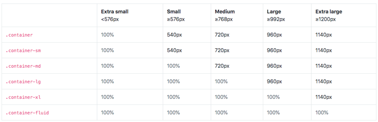

# HTML

- closing tag: `<hr />, <br />, <meta>, <input>`

- anchor element:  
  `<a href="http:// "> website </a>`  
  target: \_self(default, current window); \_blank(new window)  
  

- image element: ``

- list: `<ol start=5> </ol>`


- input:
  - `<input type="text / password / radio / checkbox / button / reset / submit / file / readonly / disabled / checked(radio or checkbox) / autofocus / name / value / file">`
  - boolean attributes: disabled、checked、readonly、multiple、autofocus、selected
  - lable & input:

        <div>
          <label for="username">user:</label>
          <input type="username" name="username" id="username">
        </div>

  - radio & checkbox: **same name**

        <div>
           <label for="male" >
              men <input type="radio" id="male" name="sex">
            </label>
            <label for="female">
              female <input type="radio" id="female" name="female">
            </label>
        </div>

- form:  
  ```
    <form method="GET / POST" action="action.php">
      First Name: <input type="text" name="firstname"><br>
      Last Name: <input type="text" name="lastname"><br>
      Email: <input type="email" required><br>
      Password: <input type="password" min="5"><br>
      Birthday: <input type="date"><br>
      Gender: <br>
        <input type="radio" name="gender">Male<br>
        <input type="radio" name="gender">Female<br>
        <input type="radio" name="gender">Other<br>
      Pets: <br>
        <input type="checkbox" name="cat">Cat<br>
        <input type="checkbox" name="dog">Dog<br>
      Cars: <br>
        <select>
          <option value="volvo"> Volve</option>
          <option value="Audio"> Audio</option>
        </select><br>
      <input type="submit" value="Register!"><br>
      <input> type="reset">
    </form>
  ```    
  - action: request URL
  - method: get(default) / post
  - target: where to open URL  

  


# CSS

## Add CSS

1. Inline: `<h1 style="color:red"> </h1>`
2. Internal: `<head> <sytle> h1 {color:red} </style> </head>`
3. External: `<head> <link rel="stylesheet" type="text/css" href="./...">`
4. Import: `@import url(./others.css);`

## CSS Selector:

1. Type selector: `h1 {}`
2. Class seletor: `.class_name{}`
3. ID selecotr: `#id_name{}`
4. Attribute selector: `a[target='blank']{}`
5. Universal selecotr: `* {}`
6. pseudo-classes:

   - 动态伪类（dynamic pseudo-classes）- :link, :visited, :hover, :active, :focus
   - 目标伪类（target pseudo-classes）- :target
   - 语言伪类（language pseudo-classes）- :lang( )
   - 元素状态伪类（UI element states pseudo-classes）- :enabled, :disabled, :checked
   - 结构伪类（structural pseudo-classes）
     - :first-child & :nth-child(1) -- 1st child,
     - :nth-child(2n) -- even,
     - :nth-child(2n + 1) -- odd
     - :nth-child(-n + 2) -- 1st and 2nd
     - :last-child & :nth-last-child(1) -- the last 1st,
     - :nth-last-child(-n + 2) -- the last 1st and 2nd,
     - :first-of-type & :nth-of-type(1),
     - :last-of-type & :nth-last-of-type(1)
     - :root, :only-child, :only-of-type, :empty
   - 否定伪类（negation pseudo-classes）- :not()

7. pseudo-elements:

   - :first-line、::first-line
   - :first-letter、::first-letter
   - :before、::before
   - :after、::after

8. Combining CSS selectors:
   - group: `h1, h2{}`
   - child: `parent > the direct child{}`
   - descendant: `ansester anychild{}`
   - sibling:
     1. adjscent: `.one + .two{}`
     2. all siblings: `.one ~ .two{}`
   - [class^="col-"] {}
   - chaining: `.head#title{}`  
     

## CSS Properties:

1. Colors: `background-color: ` & `color: `  
   color_name: red; yellow;  
   hex_color: #5D3891;

2. Text:
   - text-decoration: none / underline / overline / line-through;
   - text-align: left / right / center / justify
   - text-transform: uppercase;
   - line-height: 

3. Font:
   - font-size:
     > `1px = 1/96th inch;`  
     > `1pt = 1/72nd inch;`  
     > `1em = 100% of parent (relative size to parent);`  
     > `1rem = 100% of root (relative size to html);`

   - font-family: 'Caveat', cursive;
   - font-weight: 400(normal) 700(bold); bold;
   - font-style: noral / italic / oblique;

4. IconFont(.ttf):

        <link rel="stylesheet" href="./iconfont.css">
        <i class="iconfont icon-shouye"></i>

5. Sprite:

        i.hot {
          background-imge: url();
          background-repeat: no-repeat;
          background-position: 192px 0;
          width: 26px;
          height: 19px;
          display: inline-block;
        }
        <i class="hot"></i>

6. background:
   - background-image: url()
   - background-size: auto; cover; contain; <%>; length
   - background-repeat: repeat; no-repeat; repeat-x; repaet-y
   - background-position: `60px 80px;` 0 0;
   - background-attachment: scroll; local; fixed

7. `line-height` vs `height`:

8. box-model:
   - box-shadow: https://html-css-js.com/css/generator/box-shadow/
   - text-shadow: https://html-css-js.com/css/generator/box-shadow/
   - `box-sizing: content-box`; (padding+border excludes width and height)
   - `box-sizing: border-box`; (padding+border includes width and height)      

9. postion:
   - static: normal flow;
   - relative: normal flow; relative to self, orignal position is still exist and dont impact others' postion;
   - fixed: to browser, 脱标, allow to set width & height, similar like inline-block;
   - absolute: 脱标, allow to set width & height, similar like inline-block;  
      
          .containter {
            positon: absolute;
            left: 0;
            right: 0; 
            bottom: 0;
            top: 0;
            margin: auto
          }
    - sticky: the nearest ancestor scroll container's scrollport.

            .parent {
              overflow: scroll
            }
            .kid {
              position: sticky;
              top: 0;
            }
            
   - z-index: only applied to positioned elements

10. display:
    - block:
    - inline: **no width, no height**
    - inline-block:
    - none: dispear
      > `hidden: display: none; visibility: hidden; rgba: 0; opacity: 0`  

11. overflow:
    - visible:
    - hidden:
    - scroll:
    - auto:    

12. float:
    wrap around, using `clear` to remove, add to wrap box

        .clear-fix::after {
          content: "";
          display: block;
          clear: both;
          visibility: hidden;
          height: 0
        }

        .clear-fix {
          *zoom: 1;
         }

13. cursor: auto / default / `pointer` / text / none

## **Responsive Website**

### 1. Media Queries:

    @medica(max-width: 600px){
      /* CSS for screens below or equal to 600px wide */
     }

  |Device|Size|
  |---|---|
  |Mobile Devices|319px - 480px|
  |iPads and Tablets| 481px - 1200px|
  |Laptops| 1201px - 1600px|
  |Desktops| 1601px - more|

### 2. Flexbox:
  * display: flex / inline-flex
      ```
        {
          display: flex;
          gap: 20px;
        }
      ```

  * concept: __flex container__ VS __flex item__
  

    1. flex container: 
        - flex-direction: "row(default) / row-reverse / column / column-reverse";
        - flex-wrap: "nowrap / wrap / wrap-reverse;
        - justfiy-content: "flex-start / flex-end / center / space-between / space-around / space-evenly";
        - align-items: along the cross axis, `flex-wrap: nowrap`, "flex-start / flex-end / center / stretch / baseline";
        - align-content: `flex-wrap: wrap`, "flex-start / flex-end /  center / space-between / space-around / space-evenly";

    2. flex item:
        - order: 
        - flex-basis: flexing along main axis to set the width or height (100px);
        - align-self: "flex-start / flex-end / center / stretch / baseline"   
        > content width < width < flex-basis < min-width< max-width 
        - flex-shrink: reach to min-width
        - flex-grow
        - flex: flex-grow flex-shrink flex-basis     

### 3. CSS Grid

      {
      display: grid;

      grid-template: 100px 100px / 100px 100px;
      grid-template-rows: 
      grid-template-colums: 
        - 1fr 1fr 1fr 1fr;
        - 100px 100px 100px 100px;
        - grid-template-rows: 100px auto(fit content);
        - grid-template-colums: 100px auto(span the rest of screen) 
        - 100px minmax(50px, 100px);
        - repeat(4, 200px) / repeat(4, 25%) / repeat(3, 1fr) /repeat(auto-fill, 100px) / repeat(2, minmax(50px, 100px));
      
      grid-template-rows: [r1-start] 100px [r1-end r2-start] 100px [r2-end r3-start] 100px [r3-end];
      grid-template-colums: [c1-start] 100px [c1-end c2-start] 100px [c2-end c3-start] 100px [c3-end];

      grid-template-rows: repeat(3, [r-start] 1fr);
      grid-template-colums: repeat(3, [c-start] 1fr);

      row-gap: 10px;
      colunm-gap: 10px;
      gap: 10px 20px;

      grid-auto-flow: row / column / row dense;

      justify-content:
      align-content:
      }  

      {
        grid-row-start: 1;
        grid-column-start: 1;
        grid-row-end: 2;
        grid-column-end: 4;

        grid-row-start: r-start 1;
        grid-column-start: c-start 1;

        grid-row-end: span 1;
        grid-column-end: span 1;

        grid-row: 2 / 3;
        grid-column: 2 / 4;
        grid-area: 2 / 1 / 3 / 3 

        grid-row: 2 / span 1; 
        grid-column: 2 / span 1;       
      }

      .container {
        width: 100vw
        height: 100vh;
        display: grid;
        grid-template-rows: 60px 1fr 60px;
        grid-template-columns: 60px 1fr;
        grid-template-areas: "header header" "nav main" "footer footer";

        justify-content:
        align-content:
        place-content:
      }
      header {
        grid-area: header;
      }
      nav {
        grid-area: nav;
      }
      main {
        grid-area: main;
      }
      footer {
        grid-area: footer;
        justify-self:
        align-self:
        place-self:
      }
      
### 3.**Bootstrap Framework**

- Install:
  1. CDN:

          <meta name="viewport" content="width=device-width, initial-scale=1.0, user-scalable=no, minimum-scale=1.0, maximum-scale=1.0, shrink-to-fit-no">
          <link rel="stylesheet" href="https://cdn.jsdelivr.net/npm/bootstrap@4.6.1/dist/css/bootstrap.min.css">
          <script src="https://cdn.jsdelivr.net/npm/jquery@3.5.1/dist/jquery.slim.min.js"></script>
          <script src="https://cdn.jsdelivr.net/npm/bootstrap@4.6.1/dist/js/bootstrap.bundle.min.js"></script>
  2. download Bootstrap
  3. npm
     > `$ npm install bootstrap`  
     > `$ yarn install bootstrap`

- Breakpoints:  
     

- Container:
  - .container: max-width @breakpoint;
  - .container-fluid：width: 100% all the time; margin: auto 0;
  - .container-{breakpoint}, default is width: 100%
  
  
- Grid System
  1. container:
    - width: 100%/breakpoint
    - padding-right: 15px
    - padding-left: 15px
    - margin-right: auto
    - margin-left: auto
  2. row: 
    - display: flex
    - flex-wrap: wrap 
    - margin-right: -15px 
    - margin-left: -15px 
  3. col:
    - position: relative
    - flex-grow: 1/ flex: 0 0 x%
    - max-width: 100% / ma-width: x%
    - padding-right: 15px
    - padding-left: 15px
    


# resource

1. diffcheck.com
2. colorhunt.co
3. fonts.google.com
4. iconfont.cn
5. spritecow.com
6. caniuse.com
7. appbrwwery.github.io/flex-layout/
8. css-tricks.com